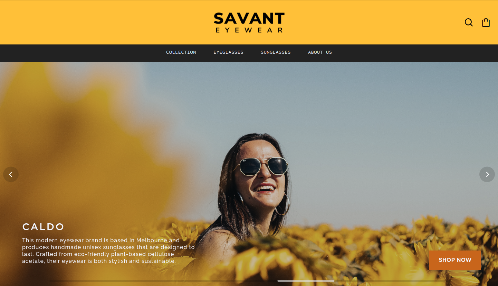
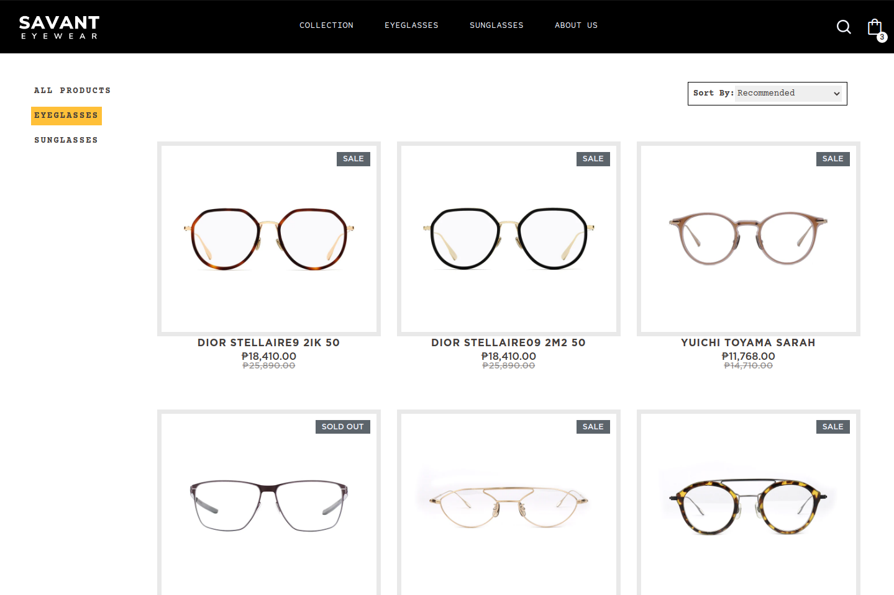
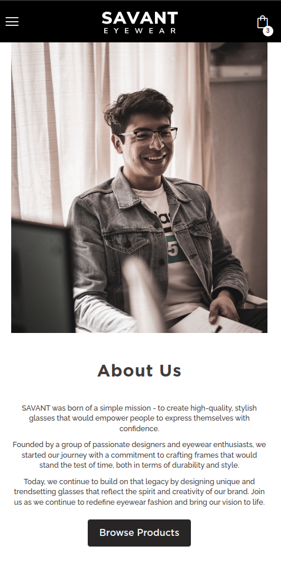

## The Odin Project

# Project: SAVANT Eyewear Shop

[**Live version** of the site can be found here](https://savant-eyewear.vercel.app//)

SAVANT Eyewear is a mock-up of an e-commerce website that sells eyewear products. The website offers a range of eyewear products, including prescription glasses and trendy sunglasses & frames. This project was created as a practice on using React Router and testing UI elements using the React Testing Library and Vitest.

### Features

1. **Cart**: The website has a cart feature where users can add items and then edit out their desired quantities on checkout. The cart is updated instantly and is passed down through a Cart Context Provider.

2. **Paginations**: The website supports pagination to enhance user experience while browsing through the eyewear products. Users can easily navigate through the different pages of the product catalog.

3. **Progressive Image Loading**: This way of loading images improves upon the user experience by providing a placeholder image of a considerably lower quality before loading the full image. This ensures that the layout is preserved and images are loaded in a smooth and efficient manner, even on slower internet connections.

4. **Product Search**: The website includes a search bar, allowing users to quickly find the products they are looking for. The search functionality is fast and reliable, making it easy to find the perfect pair of glasses.

5. **Product Sorter**: The website also features a product sorter, allowing users to sort the eyewear products based on a range of criteria. Users can sort by price, popularity, and alphabetically, making it easy to find the best products for their needs.

### Built With

- Vite + React
- React Router
- Framer Motion
- React Libraries:
  - [react-flickity-component](https://www.npmjs.com/package/react-flickity-component)
  - [react-intersection-observer](https://www.npmjs.com/package/react-intersection-observer)
  - [react-paginate](https://www.npmjs.com/package/react-paginate)
  - [react-progressive-graceful-image](https://www.npmjs.com/package/react-progressive-graceful-image)
  - [react-debounce-input](https://www.npmjs.com/package/react-debounce-input)
- Sass
- HTML5

### Getting Started

In order to setup and work on this project on your own, you will need to:

1. Clone this project:  
   `git clone https://github.com/renchester/eyewear-store.git`

2. Once you have cloned this project, you can install the required dependencies by using:  
   `npm install`

3. A live demo of the project can be started by using:  
   `npm run preview`

4. Distribution files can be produced using:  
   `npm run build`

### Credits/Acknowledgments

This project is for personal use only. I do not own any of the rights for the assets used in this project.

The images used are from Unsplash and the credits for the creators of the photos can be found [here](https://github.com/renchester/eyewear-shop/blob/main/credits.md).

Product data and images were retrieved from [Ronnie & Joe](https://ronnieandjoe.com/).

### Display

Home Page - Hero Section

Product Display Page - Gallery Section

About Us Page - Mobile

### To-do

1. A map section that can be put in the about page that lists the store's _fictional_ physical locations.

2. An improved checkout page.

---

Developed by **Renchester Ramos**
